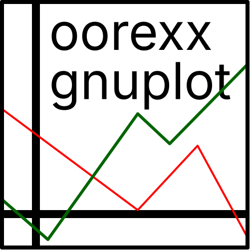

# oorexx-gnuplot

  

A native Gnuplot wrapper library for Open Object Rexx.

## Description

This is a native wrapper library for interacting with [Gnuplot](http://gnuplot.info/) from [Open Object Rexx](https://sourceforge.net/projects/oorexx/files/).

Gnuplot is a portable command-line program that can create 2D and 3D plots of functions, data, and data fits.

## Features

- Dual workflow: generates standalone plot files or controls Gnuplot interactive sessions.
- Direct Array Plotting: plots data stored in Open Object Rexx `Array` objects.
- Cross-Platform: runs on POSIX operating systems and Windows.

## Architecture

The library implements two main independent classes located in two files. Each class targets a different workflow:

- **`Gnuplot` (in `Gnuplot.rex`)**: for autonomous scripts and direct file exports.

  It generates a temporary script and feeds it to Gnuplot.
  
- **`GnuplotSession` (in `GnuplotSession.rex`)**: for interactive control, real-time animations and intensive use of Gnuplot.

  It uses a single running Gnuplot instance.

## Requirements

- [Open Object Rexx](https://sourceforge.net/projects/oorexx/) 4 or 5
- [Gnuplot](http://gnuplot.info/)

## Status

Both classes have been used for several years in Linux and Windows for small scripts without any problems.

Some parts of the API may still benefit from minor polishing.

## Limitations

- **Core Features Only**: The library implements the most common Gnuplot commands and options. You may need to pass more advanced commands manually.
- **Synchronous Scripting**: The `Gnuplot` class writes temporary files. Therefore, for use cases where heavy I/O overhead is a concern, `GnuplotSession` should be preferred.

## Installation

Copy `Gnuplot.rex` and `GnuplotSession.rex` to a directory included in your `REXX_PATH` (or `PATH`) and import it using the `requires` directive:

~~~rexx
::requires 'Gnuplot'
::requires 'GnuplotSession'
~~~

Alternatively, load it as an external routine:

~~~rexx
call 'Gnuplot'
call 'GnuplotSession'
~~~

## Quick Start

### `Gnuplot` class example

~~~rexx
gp = .Gnuplot~new
gp~title  = 'Sine & Cosine Functions'
gp~grid   = 'xtics ytics'
gp~xlabel = 'X Axis'
gp~ylabel = 'Y Axis'

plot1 = gp~add('sin(x)')
plot1~title = 'Sine'
plot1~width = '2'
plot1~with = 'lines'

plot2 = gp~add('cos(x)')
plot2~title = 'Cosine'
plot2~width = '1'
plot2~with = 'points'

gp~plot

::requires 'Gnuplot'
~~~

### `GnuplotSession` class example

~~~rexx
g = .GnuplotSession~new~~open

-- Set properties dynamically
g~grid  = ''
g~size  = 'square'
g~title = '"Interactive Session Example"'

-- Dynamic method calls and animation loop
do i = 1 to 4
  g~plot('sin('i'*x) title "sin('i'x)" lw 2 lc "purple"')
  g~pause(1)
end

-- Unset properties dynamically
g~grid = .nil

-- Plot arrays directly using datablocks
x = (1, 2, 3, 4, 5)
y = (1, 4, 9, 16, 25)
db = g~data(x, y)

g~plot(db 'with linespoints pt 7 lw 2 title "x^2"')

g~close

::requires 'GnuplotSession'
~~~

## Examples

The `examples/` directory contains additional runnable examples demonstrating the library's main features.

- Files starting with `gnuplot` demonstrate the `Gnuplot` class.
- Files starting with `session` demonstrate the `GnuplotSession` class:
  - Files containing `explicit` use explicitly defined methods.
  - Files containing `dynamic` showcase ooRexx's dynamic message dispatch (`unknown`).

## `Gnuplot` Class Reference

The `Gnuplot` class (defined in `Gnuplot.rex`) provides an object-oriented interface to configure a plot session, add multiple data series or functions, and export or display the final result.

### Class Attributes

| Attribute | Type | Description |
| :--- | :--- | :--- |
| `terminals` | `.Directory` | Maps file extensions to Gnuplot terminal definitions (e.g., `png` -> `'pngcairo enhanced'`, `pdf` -> `'pdfcairo...'`). |

### Instance Attributes

These properties let you configure the global layout and behavior of your plot.

| Attribute | Type | Default | Description |
| :--- | :--- | :--- | :--- |
| `bin` | `.String` | `'gnuplot'` | Path to the Gnuplot executable. |
| `persist` | boolean | `.true` | If `.true`, keeps the interactive plot window open after the script ends. |
| `debug` | boolean | `.false` | If `.true`, outputs the entire generated Gnuplot script to the stderr stream (`.error`) for troubleshooting. |
| `constants` | `.Directory` | Empty | User-defined variables that will be declared at the top of the generated script. |
| `title` | `.String` | `.nil` | Main title of the figure. |
| `key` | `.String` | `'top left'` | Legend / Key position and options. |
| `grid` | `.String` | `.nil` | Grid configuration (e.g., `'xtics ytics'`). |
| `width` | `.String` | `.nil` | Output width. |
| `height` | `.String` | `.nil` | Output height. |
| `xlabel` / `ylabel` | `.String` | `.nil` | Axis labels (bottom / left). |
| `x2label` / `y2label` | `.String` | `.nil` | Secondary axis labels (top / right). |
| `terminal` | `.String` | `.nil` | Explicitly overrides the Gnuplot output terminal (e.g., `'wxt'`, `'pdf'`). |
| `output` | `.String` | `.nil` | Target file path. **Setting this dynamically updates the `terminal` and `persist` options based on the file extension.** |

### Methods

- `add(input)`: Adds a new data series or mathematical function to the plot list.

  `input` can be one of the following types:
  
  - `.String`: a mathematical expression (e.g., `'sin(x)'`).
  - `.Array`: an array of coordinate columns (e.g., `.array~of(x_col, y_col)`).
  
    Automatically configures `using` to `'1:2'`.
    
  - `.Stream`: Path to a data file.
  - `.File`: An ooRexx File object representing a data file.
  
  **Returns:** A `.Directory` object representing the newly created series, allowing you to configure series-specific properties:
  
  - `title`: Name in the legend.
  - `width`: Line width (`lw`).
  - `with`: Plotting style (e.g., `'lines'`, `'points'`).
  - `color`: Line/Point color (`lc`).

- `plot([output_file])`: Generates and executes a 2D plot script.

  `output_file` *(optional)*. If provided, sets the `output` attribute before rendering.

  **Returns:** The return code (`rc`) of the Gnuplot process call.

- `splot([output_file])`: Generates and executes a 3D surface/contour plot script.

  `output_file` *(optional)*. If provided, sets the `output` attribute before rendering.

  **Returns:** The return code (`rc`) of the Gnuplot process call.

## `GnuplotSession` Class Reference

The `GnuplotSession` class (defined in `GnuplotSession.rex`) maintains a persistent pipe connection to a single running instance of Gnuplot. This allows sending continuous commands in real-time, making it ideal for interactive shells or live animations.

### Instance Attributes

| Attribute | Type | Default | Description |
| :--- | :--- | :--- | :--- |
| `gpbin` | `String` | `'gnuplot'` | Path to the Gnuplot executable. |

### Methods

- `open()`

  Initializes the background Gnuplot process and establishes communication.

  - On **POSIX** systems, it creates a temporary FIFO (named pipe) and redirects it to Gnuplot running with the `-p` (persist) flag.
  - On **Windows**, it runs Gnuplot under `WScript.Shell` and captures its standard input (`stdin`).

  **Returns:** `0` on success, or a non-zero system return code on failure.

- `close()`

  Sends the `quit` command to Gnuplot, closes the communications pipe, and cleans up any temporary FIFO files.

  **Returns:** System cleanup status.

- `command(cmd_string)`

  Sends a raw command string directly to the active Gnuplot process.

  `cmd_string` is the command to execute.

  **Returns:** `1` (Windows) or the system write result (POSIX).

The following methods are shortcut helpers that prepend their respective Gnuplot keywords before sending the command string:

- `data(content, [y_or_name], [name])`

  Creates an inline Gnuplot datablock (`$data1`, `$data2`, etc.) directly in memory without writing temporary files to disk.

  - **From two 1D Arrays:** `gp~data(x_array, y_array)`
  - **From a 2D Matrix Array:** `gp~data(matrix)`
  - **From a multiline String:** `gp~data(raw_string)`

  **Returns:** The assigned datablock name string (e.g., `'$data1'`).
  
- `[]=(value, key)`

  Syntactic sugar for configuring Gnuplot environment options using collection-style bracket notation:

  - **Set Option with Value:** `g['title'] = '"My Title"'` (sends `set title "My Title"`)
  - **Set Flag:** `g['grid'] = ''` (sends `set grid`)
  - **Unset Option:** `g['grid'] = .nil` (sends `unset grid`)

- `set(opt)`: Sends `set <opt>` (e.g., `session~set('grid')`).
- `unset(opt)`: Sends `unset <opt>`.
- `reset(opt)`: Sends `reset <opt>`.
- `plot(args)`: Sends `plot <args>` (e.g., `session~plot('sin(x) with impulses')`).
- `splot(args)`: Sends `splot <args>`.
- `replot(args)`: Sends `replot <args>`.

### Dynamic Command Dispatch (`unknown` Method)

`GnuplotSession` intercepts unhandled messages using ooRexx's `unknown` mechanism to map native syntax directly to Gnuplot commands:

- **Set property:** `gp~grid = ''` sends `set grid`
- **Set property with value:** `gp~title = '"My Title"'` sends `set title "My Title"`
- **Unset property:** `gp~grid = .nil` sends `unset grid`
- **Dynamic methods:** `gp~pause(3)` sends `pause 3`
- **Dynamic commands:** `gp~fit('f(x) $data1 via a, b')` sends `fit f(x) $data1 via a, b`

## License

Distributed under the terms of the [LICENSE](LICENSE) file.

## Author

Salvador Parra Camacho

GitHub: https://github.com/sparrac
